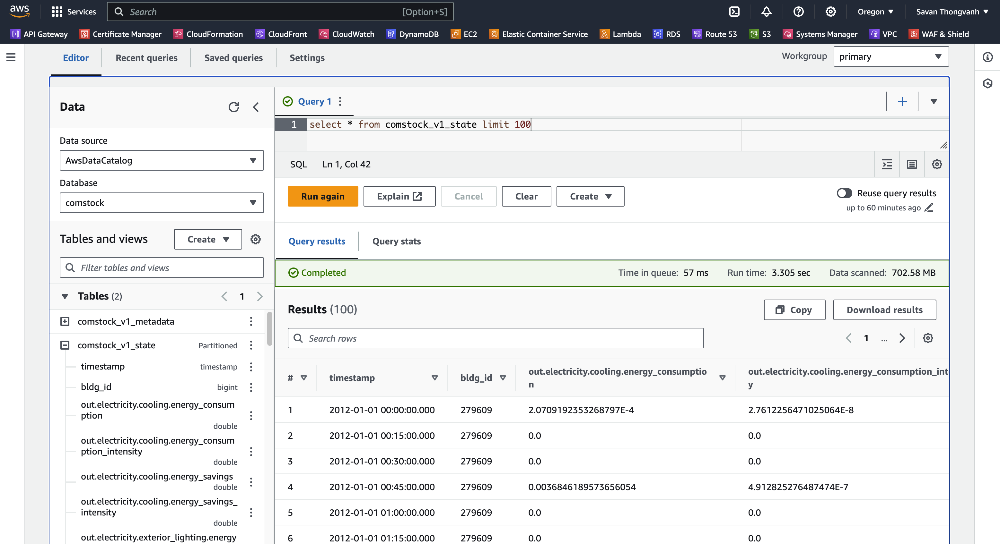

# comstock_athena_example
This project is a bare bones example of creating a handful of resources in AWS that enable querying comstock data that's described in the readme at https://github.com/openEDI/documentation/blob/main/NREL_Building_Stock/Query_ComStock_Athena.md

The instructions at the readme work fine but if you're interested in having some reusable scripts or just getting to querying faster you can follow these 3 simple steps.

Two assumptions are made
1. You have the AWS CLI tools installed (https://docs.aws.amazon.com/cli/latest/userguide/getting-started-install.html)
2. You have a profile created 

Using these instructions will create the following resources in your AWS Account
1. An AWS Glue _database_ called comstock
2. An AWS Glue _table_ called comstock_v1_metadata
3. An AWS Glue _table_ called comstock_v1_state

## Update properties to suit your project
Update project.properties to suit your account
```bash
PROJECT_NAME=comstock-athena-example
DEFAULT_REGION=your default region
AWS_PROFILE=your aws profile name
```

## Failed deployments
In case of failed deployments your can use ```deletestack.sh``` script to delete the failed stack before trying to redeploy again.  Very simply

```bash
./deletestack.sh
```

## Step 1 Deploy the Athena Glue db
Deploy the glue table by making sure the tables are commented out of ```cloudformation/app.yaml``` and executing

```bash
./deploy.sh
```

## Step 2 Deploy the tables
Uncomment the tables in ```cloudformation/app.yaml``` and then redeploy

```bash
./deploy.sh
```

## Step 3 Update Athena table partitions

### Console instructions
- Go into Athena in the AWS console in the region you have set as DEFAULT_REGION
- Select the comstock db
- Repair the tables by executing the command per the instructions at https://github.com/openEDI/documentation/blob/main/NREL_Building_Stock/Query_ComStock_Athena.md#establishing-partitions-on-the-time-series-table

```sql
MSCK REPAIR TABLE comstock_v1_state
```

## Query the tables
You can now query the metadata and state tables per the instructions using Athena
https://github.com/openEDI/documentation/blob/main/NREL_Building_Stock/Query_ComStock_Athena.md#running-queries-against-comstock

